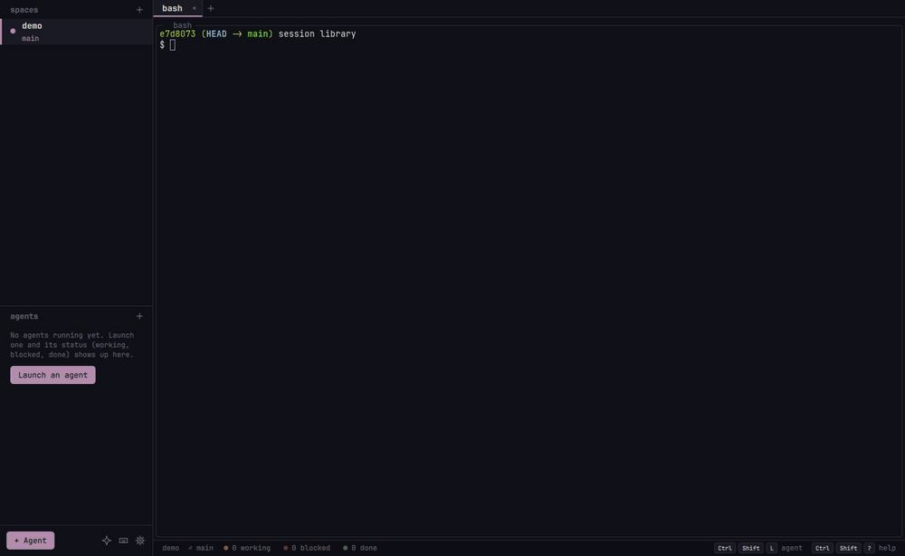
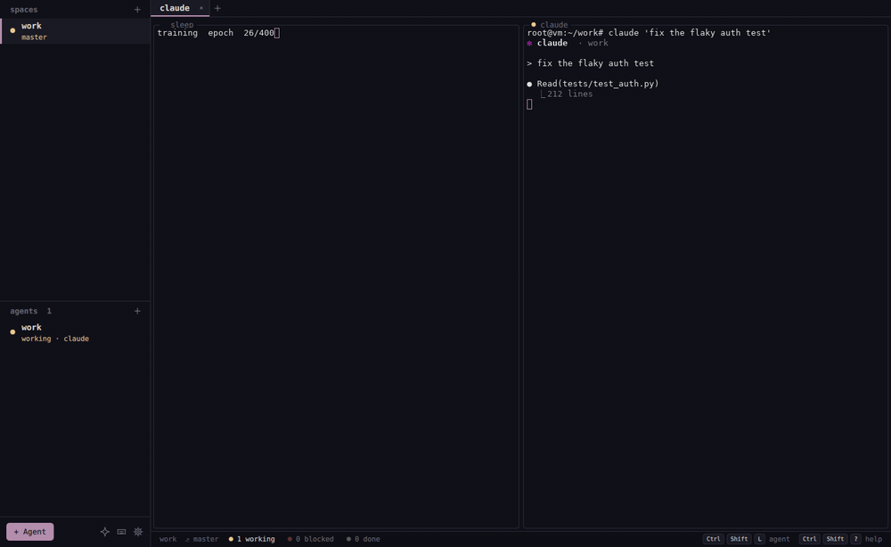

<h1 align="center">nebula</h1>

  <b>All your terminal AI agents, side by side, and one that runs them for you.</b> 
  A native Linux workspace for Claude Code, Codex, opencode, Gemini and any other CLI agent.

  
  
  

  

  <a href="#install">Install</a> · <a href="docs/usage.md">Guide</a> · <a href="docs/views.md">Views</a> · <a href="docs/agents.md">Agents</a> · <a href="docs/automation.md">Automation</a>

## Ask once, and nebula runs the agents

Run any CLI agent in spaces, tabs and splits. nebula knows which agent is **working**, **blocked** on a prompt or **done**, and `Ctrl+Shift+A` takes you to the one that needs you. Tell the built-in **operator** what you want in plain words: it launches agents, each in its own git worktree, prompts them and answers their permission prompts. It works with your Claude Code or ChatGPT subscription, so no API key is needed.

## Results you can see, not scroll

Agents answer with **views**: 26 components, from tables and charts to 3D WebGL plots, formulas with sliders, molecules and proteins, genomes, maps, Mermaid diagrams, citations and provenance. Every document is checked before it is drawn, and the agent is told exactly what to fix. It can take a snapshot of what you see, and you can export any view to HTML or PDF. [See them all →](docs/views.md)

## Close it, crash it: it keeps running

A small background host owns your shells, not the window. Kill the window and your agents keep working; the next launch reattaches every pane, mid-output. After a reboot the layout comes back, and each agent's resume command is typed for you.

## Why nebula

- **Native and light**: C++ and Qt Quick with a real terminal (libvterm). It follows your Omarchy theme and font live.
- **Keyboard first**: every shortcut is `Ctrl+Shift+…`, so nothing is taken from your shell or TUIs, and you can rebind them all.
- **Made to be driven**: an MCP server lets one agent delegate to and supervise others, and `nebula ctl` does the same from any script.
- **Private by design**: views run offline in a sandbox, API keys live in your keyring, and summaries are opt-in.

## Install

| Distro | |
|---|---|
| Arch / Omarchy | `sudo pacman -U https://github.com/enrell/nebula/releases/latest/download/nebula-<ver>-1-x86_64.pkg.tar.zst` |
| Debian 13, Ubuntu 25.04+ | `sudo apt install ./nebula_<ver>_amd64.deb` (from the [release](https://github.com/enrell/nebula/releases/latest)) |
| Fedora 41+ | `sudo dnf install <url of nebula-<ver>-1.x86_64.rpm>` |
| Anything else | `curl -fsSL https://raw.githubusercontent.com/enrell/nebula/main/install.sh \| sh` |

Portable builds, arm64 and building from source are covered in [docs/install.md](docs/install.md).

## Quick start

1. Run `nebula`. A short setup wizard finds your agents and offers to install the status hooks.
2. `Ctrl+Shift+L` launches an agent, `Ctrl+Shift+I` opens the operator, and `Ctrl+Shift+?` shows every key.
3. Close the window whenever you like: everything is still there next time.

## Documentation

| Guide | Covers |
|---|---|
| [Using nebula](docs/usage.md) | keys, mouse, sessions, settings, files |
| [Agents](docs/agents.md) | launcher, profiles, status hooks, MCP server, the operator |
| [Views](docs/views.md) | every component, the checker, export and snapshots |
| [Automation](docs/automation.md) | the socket API and `nebula ctl` |
| [Contributing](CONTRIBUTING.md) | building, testing, what a good pull request looks like |
| [Security](SECURITY.md) | the security model and private reporting |

Inspired by [herdr](https://github.com/ogulcancelik/herdr). [MIT](LICENSE) licensed.
