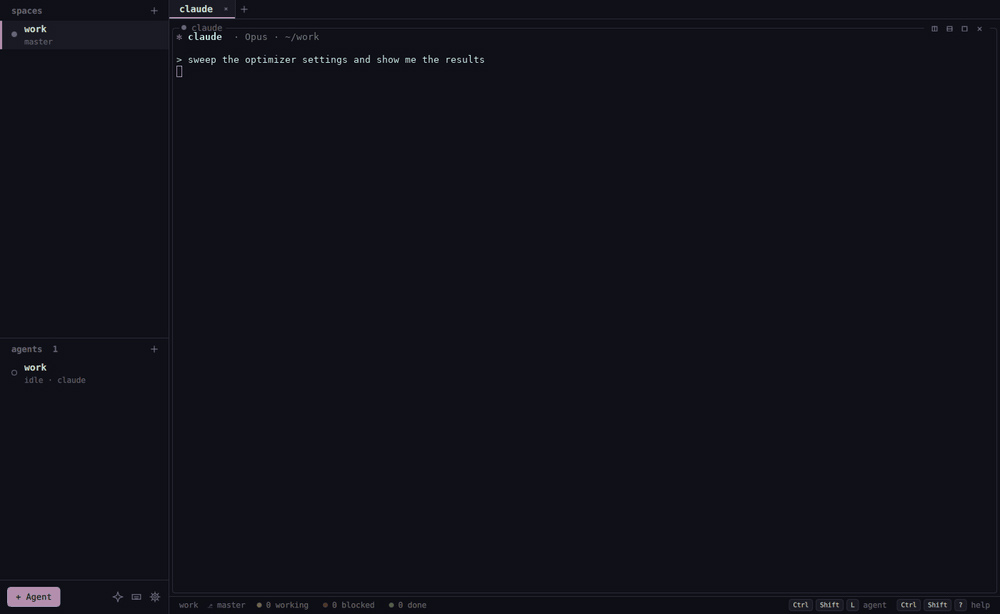
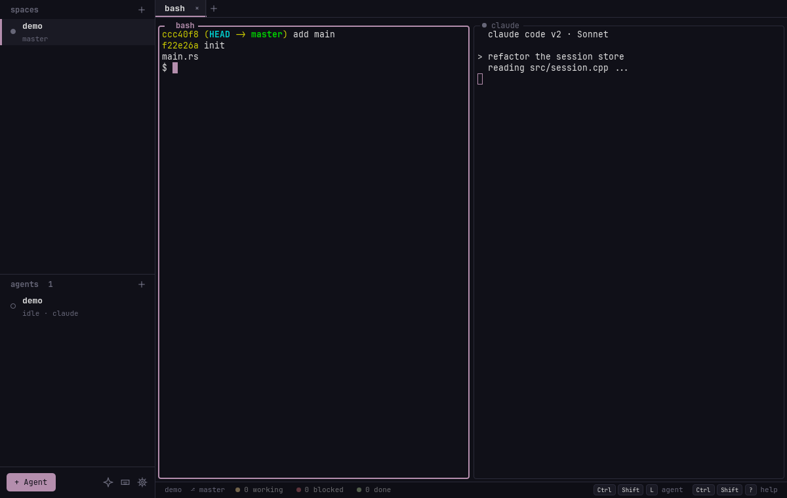
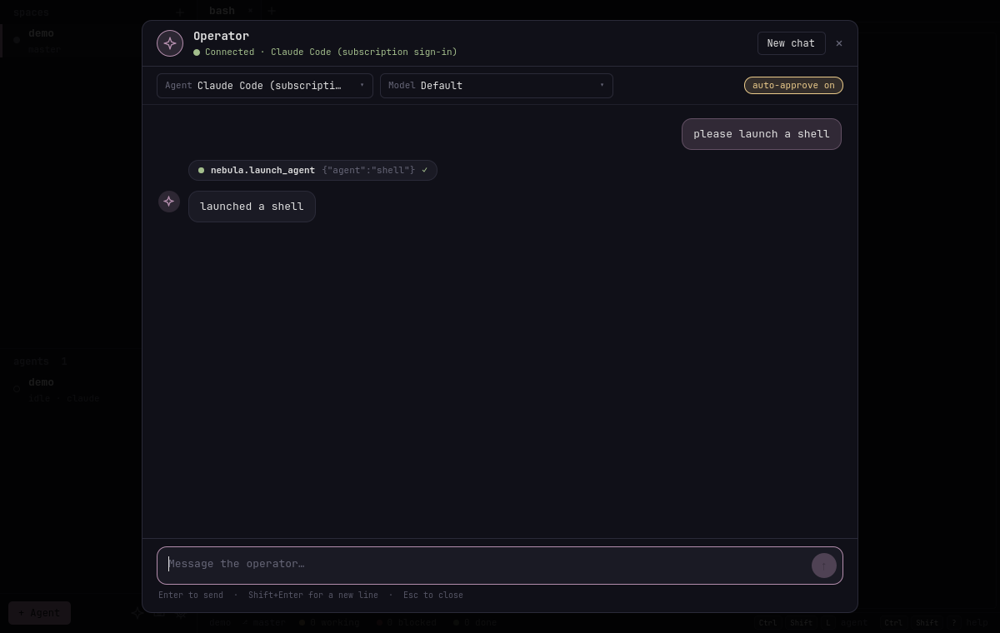
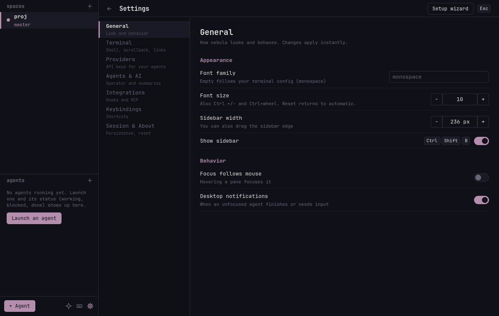
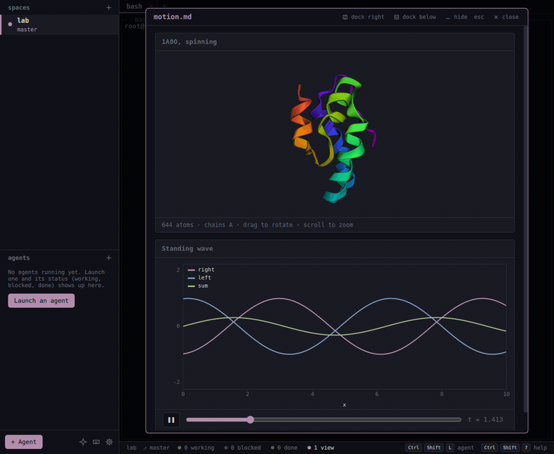

<h1 align="center">nebula</h1>

<p align="center">
  A native workspace for running several terminal AI agents side by side.
</p>

<p align="center">
  <a href="https://github.com/enrell/nebula/actions/workflows/ci.yml"></a>
  <a href="https://github.com/enrell/nebula/releases/latest"></a>
  <a href="LICENSE"></a>
</p>

<p align="center">
  
</p>

## Introduction

nebula runs Claude Code, Codex, opencode, Gemini, aider or any other CLI in
spaces, tabs and split panes, and shows a live *working / blocked / done*
status for every agent so you always know which one needs you. A built-in
**operator** lets you launch, prompt and supervise them by chatting.
Inspired by [herdr](https://github.com/ogulcancelik/herdr). It follows the
current Omarchy theme and terminal font live.

- **Panes, tabs and spaces**: a real terminal (libvterm + PTY) with splits, zoom, scrollback and IME support.
- **Agent status**: exact state through hooks, or screen heuristics as a fallback, in the sidebar, status bar and desktop notifications.
- **Launcher**: any agent CLI, with API-key profiles and an optional git worktree per agent so parallel work doesn't collide.
- **Operator**: a built-in agent that drives nebula through MCP; subscriptions (Codex, Claude Code) work without an API key.
- **Views**: agents show results as rich documents in a modal or docked next to them, validated before they are drawn and styled by your theme: tables, charts and 3D WebGL plots, formulas with sliders, molecules and proteins, alignments and genome tracks, vector fields, volumes, networks, Mermaid diagrams, maps, citations and provenance, exportable to HTML or PDF.
- **Persistent sessions**: a background host owns the panes, so closing or crashing the window never kills your shells or agents.
- **Scriptable**: a Unix-socket JSON API, `nebula ctl` and an MCP server.

Stack: C++20, Qt 6 Quick, libvterm, forkpty; views use Qt WebEngine. MIT licensed.



| Operator chat | Settings |
|---|---|
|  |  |

## Install

Every release has native packages (small, use your distro's Qt) and a portable build (Qt bundled, any distro):

| Distro | Install |
|---|---|
| Arch / Omarchy | `sudo pacman -U https://github.com/enrell/nebula/releases/latest/download/nebula-<ver>-1-x86_64.pkg.tar.zst` (AUR `nebula-bin` / `nebula-git` once AUR registration reopens; the PKGBUILDs are in `packaging/aur/`) |
| Debian 13, Ubuntu 25.04+ | download `nebula_<ver>_amd64.deb` / `arm64.deb` from the release, `sudo apt install ./nebula_*.deb` |
| Fedora 41+ | `sudo dnf install <url of nebula-<ver>-1.x86_64.rpm>` |
| Anything else (x86_64, aarch64) | `curl -fsSL https://raw.githubusercontent.com/enrell/nebula/main/install.sh \| sh` |

The installer puts the portable build in `~/.local/lib/nebula` (no root, checksum verified) and links `~/.local/bin/nebula`; `... | sh -s -- --uninstall` removes it. The x86_64 build is made on Ubuntu 22.04 (glibc 2.35 or newer), the aarch64 one on Ubuntu 24.04 (glibc 2.39 or newer); both only expect the usual desktop libraries (OpenGL/EGL, fontconfig, X11 or Wayland).

**From source** (Qt >= 6.5 with Quick, WebEngine and WebChannel, libvterm >= 0.3, CMake, Ninja):

    sudo pacman -S qt6-base qt6-declarative qt6-wayland qt6-webengine qt6-webchannel libvterm cmake ninja   # or your distro's equivalents
    just build && sudo just install

Releases are built by CI when a `vX.Y.Z` tag matching the version in `CMakeLists.txt` is pushed (`.github/workflows/release.yml`).

## Getting started

1. Run `nebula`. On first launch a short **setup wizard** picks your font size, detects the agent CLIs on your machine, optionally saves an API key, and offers to install the state hooks. Reopen it any time from Settings > *Setup wizard*.
2. Press `Ctrl+Shift+L` to launch an agent (claude, codex, opencode, ...), optionally in its own git worktree. Its status shows up in the sidebar and the status bar; `Ctrl+Shift+A` jumps to whichever agent needs you.
3. Press `Ctrl+Shift+I` to open the operator chat and ask for things like *"launch claude and codex on the flaky test, each in a worktree"*.
4. Close the window whenever you like: shells and agents keep running and are reattached next time.

## Development (`just`)

| Recipe | What |
|---|---|
| `just build` / `just run` | release build / build and run |
| `just dev` | debug build, isolated instance (own socket + state) |
| `just watch` | rebuild + restart dev instance on change (watchexec) |
| `just test` / `just e2e` | unit tests / API end-to-end test |
| `just renderer` / `just e2e-views` | rebuild and test the views renderer (needs node) / views end-to-end test |
| `just ctl <args>` / `just dctl <args>` | talk to the running / dev instance |
| `just events` | stream agent events |
| `just screenshots` / `just media` | regenerate README screenshots (headless) / the GIF and view images (needs Xvfb, Mesa, ffmpeg) |
| `just pkg` | build the Arch package from the checkout |
| `just release-local` | build every release artifact in docker containers into `dist/` |
| `just install` / `just clean` / `just fmt` / `just lint` | misc |

## Keybindings (no prefix; press `Ctrl+Shift+?` in the app)

| Keys | Action |
|---|---|
| `Ctrl+Shift+D` / `Ctrl+Shift+E` | split right / down |
| `Ctrl+Shift+W` / `Ctrl+Shift+Z` | close / zoom pane |
| `Ctrl+Shift+Arrows` | focus pane |
| `Ctrl+Shift+T`, `Ctrl+Tab`, `Ctrl+Shift+Tab`, `Ctrl+PgUp/PgDn`, `Alt+1-9` | new tab, next/prev, jump |
| `Ctrl+Shift+N` / `Ctrl+Shift+Q` / `Ctrl+Shift+R` | new / close / rename space |
| `Ctrl+Shift+PgUp/PgDn`, `Ctrl+Alt+1-9` | prev/next space, jump |
| `Ctrl+Shift+A` | jump to the agent that is blocked / done |
| `Ctrl+Shift+L` / `Ctrl+Shift+M` | launch an agent / broadcast a prompt |
| `Ctrl+Shift+I` | operator (built-in AI that runs nebula) |
| `Ctrl+Shift+O` | show / hide agent views (the modal) |
| `Ctrl+Shift+B` / `Ctrl+,` | toggle sidebar / settings |
| `Ctrl++` `Ctrl+-` `Ctrl+0` / `Ctrl+wheel` | font size |
| `Ctrl+Shift+C/V`, `Shift+PgUp/PgDn` | copy/paste, scrollback |

All `Ctrl+Shift+…` combos are unused by terminal programs, so nothing is stolen from your shell/TUIs. Override in `~/.config/nebula/keys.conf`:

    Ctrl+Shift+D = split-right
    Alt+Left = focus-left
    Ctrl+Shift+Q = none

Actions: split-right split-down close-pane zoom-pane focus-left/right/up/down new-tab close-tab next-tab prev-tab goto-tab:N new-space rename-space close-space next-space prev-space goto-space:N next-attention toggle-views toggle-sidebar open-settings launch-agent operator broadcast toggle-help font-larger font-smaller font-reset.

## Agents: profiles, launcher, hooks, MCP, operator

**Profiles** (Settings > Providers): a named API key (Anthropic, OpenAI, OpenRouter, Gemini or any OpenAI-compatible endpoint) injected as env vars (`ANTHROPIC_API_KEY`, ...) into the panes that use it. Keys live in the system keyring via Secret Service (`secret-tool`; falls back to a 0600 file), never in `settings.json`/`session.json`. Set a default profile, a per-space profile (right-click a space), or pick one per launch. `nebula ctl profile.list|set|remove|default|test`.

**Launcher** (`Ctrl+Shift+L`, or `+` next to *agents*): pick claude/codex/opencode/gemini/aider/shell (add your own in `~/.config/nebula/agents.conf`, one `name = command` per line), profile, model, directory, where to open it (split/tab/space), optionally a fresh **git worktree + branch** so parallel agents don't collide, and an initial prompt. `nebula ctl agent.launch agent=claude prompt="fix the flaky test" worktree=true branch=fix/flaky`. `Ctrl+Shift+M` broadcasts one prompt to several agents.

**Hooks** (Settings > Agent integrations): exact `working / blocked / done` state instead of screen heuristics. Claude Code (`~/.claude/settings.json`), opencode (plugin) and codex (`notify`, turn completion only). Your files are merged, never overwritten, and backed up as `*.nebula-bak`; Remove restores them. Hooks run `nebula ctl pane.report_state` and are silent no-ops outside nebula.

**MCP server**: `nebula mcp` (stdio). Install it for claude/opencode/codex/gemini from the same settings section, or add it yourself: `claude mcp add --scope user nebula -- /path/to/nebula mcp`. Tools: `whoami`, `list_panes`, `list_agents`, `list_spaces`, `list_profiles` (never secrets), `read_pane`, `send_text`, `send_keys`, `launch_agent`, `wait_for_state`, `broadcast`, `close_pane`, `create_space`, `view_show`, `view_components`, `view_get`, `view_export`, `view_snapshot` (see [Views](#views)). This lets one agent delegate to and supervise others. It is real terminal control: only install it in agents you trust.

**Operator** (`Ctrl+Shift+I`, Settings > Agents & AI): a built-in agent that operates *nebula itself*. It is a real agent CLI: nebula spawns it, gives it a `nebula` MCP server (the same tools external agents get, `src/tools.cpp`), and streams its turns into a panel. Because the agent authenticates itself, **subscriptions work out of the box** — Codex (ChatGPT) and Claude Code (subscription) are driven **natively**, with no adapter and no npm: Claude through `claude -p --input-format stream-json`, Codex through `codex app-server` (`src/nativeagents.cpp`). `opencode acp`, `gemini --acp` or any other [ACP](https://agentclientprotocol.com) command set under Settings > Agents & AI use ACP. Empty auto-detects codex → claude → opencode → gemini, and the chat has agent and model dropdowns (the model choice is remembered as `operatorModel`); when a configured model is unavailable, a stale model in the agent's own CLI config is healed automatically through `session/set_config_option` (or the native equivalent) using the account's real model list. Tell it things like "launch claude and codex on the flaky auth test, each in a worktree" or "which agents are blocked? approve the first one"; it lists/reads panes, launches and prompts agents, answers permission prompts, and reorganizes spaces/tabs/splits. Tool calls are **auto-approved by default** (the "auto-approve on" badge in the chat header toggles it); turn it off and every tool call shows an Allow/Deny prompt in the chat. The chat is restored after a restart as display history only (the agent starts fresh), idle agents that vanish are reconnected, and error cards have a *Copy log* button that copies the agent state, stderr and the last protocol lines for bug reports (`NEBULA_ACP_TRACE=1` also prints the wire log). Pane text is marked untrusted in the instructions sent to the agent. Non-interactive use: `nebula ctl operator.ask prompt="..." approve=all` (`approve=none` rejects every permission request).

**Summaries** (optional, off by default because it sends terminal output to your provider): a one-line "what it did" when an unfocused agent finishes, shown in the sidebar and the desktop notification. Toggle under Settings > Agents & AI. `nebula ctl llm.ask prompt="..."` is a plain one-shot chat request against a profile.

## Views

| An agent's view, in the modal (default) | Docked next to the agent |
|---|---|
|  |  |


A view shows a document instead of a terminal. Agents create one with the `view_show` MCP tool (or anything else with `nebula ctl view.show`). By default it opens as a **modal** over the workspace, so small split panes are not squeezed; its header docks it next to the agent that made it (right or below), a docked view's pop-out button brings it back to the modal, and Settings > General > *Agent views open* makes docking (or a new tab) the default. `Esc`, `Ctrl+Shift+O` or a click outside hides the modal without losing it (the status bar shows `N views`; click it or press `Ctrl+Shift+O` again); *close* discards it. Docked views are saved with the session, modal ones are not.

The document is Markdown plus **components**, fenced blocks whose body is YAML:

````markdown
---
title: Session store refactor
---
The store now sits behind one interface.

```nebula:stats
- {label: Tests, value: 120, delta: +18, tone: good}
- {label: p95 latency, value: 38ms, delta: -41%, tone: good}
```

```nebula:table
data: results.csv          # read from disk: big data never goes through the model
sort: {by: failed, desc: true}
```
````

Components, by field (`view_components` lists them with a one-line summary each):

| Field | Component | Shows |
|---|---|---|
| General | `callout` | info / success / warning / danger / note box |
| | `stats` | a row of key numbers with change, tone, uncertainty (`12.3 ± 0.4`) and units |
| | `table` | sortable table from inline rows or a `.csv` / `.tsv` / `.json` file; columns with units and errors |
| | `checklist` | plan with a status per item (`[x]` done, `[~]` running, `[!]` failed, `[-]` skipped) and progress |
| | `code` | highlighted code, inline or from a file and line range |
| | `image` | a png / jpg / gif / webp / svg; optional zoom and pan, a before/after `compare` slider and a true scale bar (`scale: "0.65 µm"`) |
| | `html` | escape hatch: the agent's own HTML/CSS/JS (canvas, WebGL, SVG) in a sandbox, with the theme as CSS variables |
| Data and math | `chart` | line / bar / area / scatter / pie / histogram / box / heatmap; error bars, bands, fits (linear … power, with R²), log axes |
| | `chart3d` | 3D scatter / bar / line / surface in WebGL, rotatable, coloured by a column |
| | `plot` | formulas: `y = f(x)`, parametric, polar and surfaces; `params` can be sliders the reader drags |
| | `matrix` | a grid (CSV, `.npy`, inline) as heatmap, contour lines or WebGL surface |
| | `math` | a numbered display equation (KaTeX); `$…$` and `$$…$$` work in any Markdown |
| Chemistry and biology | `molecule` | 2D structures from SMILES, one or a grid |
| | `reaction` | reaction SMILES with conditions over the arrow |
| | `structure` | 3D molecules (PDB, mmCIF, SDF, MOL2, XYZ, GRO) in WebGL: cartoon or sticks, highlighted residues |
| | `sequence` | DNA / RNA / protein sequences and alignments (FASTA): residue colours, consensus, conservation, annotations |
| | `tree` | phylogenies from Newick: branch lengths, support values, highlighted leaves |
| | `tracks` | genome-browser tracks over a region: BED features with exons and strand, bedGraph signal, variants |
| Physics | `field` | vector fields from formulas or a `.npy` grid: evenly spaced streamlines, arrows, a scalar background, sliders |
| | `animation` | curves `y(x, t)`, moving points with trails, or simulation frames from `.npy`; play, pause, scrub |
| | `volume` | 3D scalar fields (`.npy`, Gaussian `.cube`): isosurfaces in WebGL next to a slice viewer |
| Networks, diagrams, maps | `graph` | networks from inline edges, a CSV edge list or JSON: force / circular layout, groups, weights, direction |
| | `diagram` | Mermaid (flowchart, sequence, class, state, ER, gantt, mindmap, …); a plain ```` ```mermaid ```` fence works too |
| | `map` | offline maps: GeoJSON and points over a built-in world basemap, choropleth by a property, projections |
| Research record | `references` | the numbered list of works cited with `[@key]` (BibTeX named in the front matter) |
| | `provenance` | what the results were computed from: every input file with its SHA-256, the git commit, command, environment, seed |

`view_components name=table` (or `nebula ctl view.components name=table`) returns a component's fields, shorthand and a valid example.

| Chemistry and biology | Physics, networks, maps, imaging | Research record |
|---|---|---|
|  |  |  |

<p align="center"></p>


**Checked before it is drawn.** Every document goes through one checker: YAML syntax, each component's schema, then semantic checks (a table column that is not in the CSV, a line range past the end of the file). `view_show` returns every problem with its line and a fix hint, e.g. `error line 12 [nebula:table] /colums: unknown field "colums" (did you mean "columns"?)`. Blocks with errors are drawn as error cards and the rest of the view still shows; the agent fixes the document and calls `view_show` again with `view=<id>` to update the same pane. Problems found while drawing (an image that does not decode) are reported too (`view_get`).

**Science in the checker, not only in the drawing.** Formats are parsed where the agent can be told what is wrong: a SMILES string with an unclosed ring, a PDB line with broken coordinates, a FASTA letter that is not an amino acid, a Newick tree missing a `)`, a GeoJSON written as latitude/longitude, a formula with an unknown variable (`sin(x - tt)`: did you mean `t`?), a slider whose value is outside its range, a citation key that is not in the bibliography. Heavy libraries (ECharts, KaTeX, 3Dmol.js, smiles-drawer, Mermaid, d3-geo) load only when a document uses them.

**Research record.** Put `bibliography: refs.bib` in the front matter and cite with `[@key]` or `[see @a, p. 3; @b]`: citations are numbered by first use and the list goes where `nebula:references` stands, or at the end. A `nebula:provenance` block lists every file the document read with its SHA-256, size and modification time, and the git commit of the repository it lives in (read from `.git`, no git process), next to the command, script, environment and seed the agent gives. **Export**: `view.export` writes a standalone HTML file (charts and WebGL frozen to images, files and fonts inlined, nothing pointing back into nebula) or a PDF. **Snapshot**: `view_snapshot` returns a PNG of the view to the agent as an MCP image, optionally scrolled to a block, so it can check that a plot or a molecule looks right before it tells you it is done.

**Files.** `view.show file=report.md` watches the file and every file the checker read for it (data, bibliographies, scripts), and re-checks and redraws on every save. Paths in a document are relative to its directory (for inline content: the agent's working directory) and cannot leave it: no absolute paths, no `..` escapes, no symlinks pointing outside.

**Isolation.** Views are drawn by Qt WebEngine in a private, off-the-record profile. A page gets only the checked document, can load only the files that document references, has no network access, cannot navigate, runs no `eval`, and raw HTML in Markdown is not rendered. Links open in your browser. An `html` block runs in its own sandboxed frame (opaque origin, no access to the view, nebula or storage, a CSP without any network source); its script errors are reported to the agent like any other render issue.

```sh
nebula ctl view.show file=report.md [where=modal|right|down|tab] [title=STR]
nebula ctl view.show content=@- < report.md          # inline content, stored with the session
nebula ctl view.show view=7 file=report.md            # update view 7 in place
nebula ctl view.dock view=7 where=right|down|tab|modal       # move between the modal and the layout
nebula ctl view.toggle                                        # hide / show the modal
nebula ctl view.get view=7 | view.list | view.close view=7 | view.components [name=table]
nebula ctl view.export view=7 format=html|pdf [path=report.pdf]   # standalone HTML, or PDF
nebula ctl view.snapshot view=7 [block=3] [path=shot.png]        # PNG of what the user sees
```

The checker and the page live in `renderer/` (JavaScript, bundled into `renderer/dist/`, which is committed so building nebula needs no node): the checker runs inside nebula in Qt's JS engine, the page in the web engine. `just renderer` rebuilds and tests it.

## Sessions (zellij-style persistence)

Panes are owned by a small background daemon (`nebula --host`, started automatically), not by the window. Close the window, crash the GUI or `kill -9` it: shells and their jobs keep running. Next launch reattaches every pane, replaying up to 2 MB of output per pane (including alt-screen/mouse modes) so scrollback and TUIs come back as you left them.

The layout (spaces, tabs, splits, ratios, names, focus, zoom) is saved continuously to `session.json` in the state dir. If the host is gone too (reboot), the layout is rebuilt with fresh shells in the same directories; panes that were running an agent get a `[nebula] session restored` note and the resume command (`claude --continue`, `opencode --continue`, `codex resume --last`, ...) typed at the prompt, ready for Enter. Panes that survive in the host but not in the layout show up in a `recovered` space.

Closing a pane/tab/space kills its shells. `kill-session` (Settings, or `nebula ctl action.run action=kill-session`) terminates everything and stops the host. Tests: `just e2e-persist`.

## Mouse

Click a pane to focus; drag dividers (double-click resets to 50%); drag the sidebar edge to resize it. Double-click selects a word, triple-click a line, drag selects (auto-copies), middle-click pastes, `Ctrl+click` opens a link, right-click opens a context menu (copy/paste/split/zoom/close/settings). Hover a pane for split/zoom/close buttons; tabs and spaces have hover close buttons; double-click a space to rename. The scrollbar appears while scrolled back and is draggable.

## Settings

Gear icon in the sidebar footer, or `Ctrl+,`. Stored in `~/.config/nebula/settings.json` (font family/size, sidebar width, shell, scrollback, copy-on-select, link clicks, focus-follows-mouse, notifications). Also scriptable: `nebula ctl settings.get`, `nebula ctl settings.set key=fontSize value=12`.

## Automation API

Unix socket `$XDG_RUNTIME_DIR/nebula.sock` (override with `NEBULA_SOCKET`), newline-delimited JSON:

    {"id":1,"method":"pane.send_text","params":{"pane":2,"text":"ls","enter":true}}
    {"id":1,"ok":true,"result":true}

CLI: `nebula ctl <method> key=value ...` (see `nebula ctl --help`), e.g.

    nebula ctl pane.list
    nebula ctl pane.split direction=down
    nebula ctl pane.send_keys keys='["Ctrl+C"]'
    nebula ctl pane.read lines=30
    nebula ctl --watch          # agent.state events

Shells started inside nebula get `NEBULA_PANE` and `NEBULA_SOCKET`. Agent hooks can report exact state (overrides heuristics for `ttl` seconds), e.g. in a Claude Code hook: `nebula ctl pane.report_state state=working`.

## Agent state

Agent = foreground process (claude, opencode, codex, gemini, aider, ...). State is classified from the bottom of the screen with per-agent patterns (permission prompts -> `blocked`, "esc to interrupt" and title spinners -> `working`), plus output activity for unfocused panes, with debounce so spinners don't flicker. `done` = finished while you were elsewhere; cleared when you focus it. Notifications via `notify-send`.

## Files and configuration

| Path | What |
|---|---|
| `~/.config/nebula/settings.json` | Settings (also editable in the app; `nebula ctl settings.get/set`) |
| `~/.config/nebula/keys.conf` | Key overrides, one `Ctrl+Shift+D = split-right` per line (`none` unbinds) |
| `~/.config/nebula/agents.conf` | Extra launcher agents, one `name = command` per line (`mytool = mytool --fast`) |
| `~/.config/nebula/secrets.json` | API keys, only when no system keyring is available (mode 0600) |
| `~/.local/state/nebula/session.json` | Layout of spaces, tabs and splits |
| `~/.local/state/nebula/operator-history.json` | Operator chat history (display only) |
| `~/.local/state/nebula/views/` | Inline content of open views |
| `$XDG_RUNTIME_DIR/nebula.sock` | Automation socket (`NEBULA_SOCKET` overrides; `NEBULA_STATE_DIR` moves the state dir) |

The operator, settings and wizard screenshots are regenerated with `tests/screenshots.sh`, the GIF and view images with `tests/media.sh` (throw-away HOME, scripted stand-in agents); the main one is a real session.

## IME

The terminal item implements Qt's input-method protocol (cursor rectangle, preedit rendering at the cursor, commit), so fcitx5/ibus composition works.

## Security

nebula can type into terminals and launch agents, so treat access to it like access to your shell. The automation socket, the MCP server and operator auto-approve are described above; see [SECURITY.md](SECURITY.md) for the security model and how to report a vulnerability privately.

## Contributing

Issues and pull requests are welcome. [CONTRIBUTING.md](CONTRIBUTING.md) explains how to build and test nebula and what a good pull request looks like: the reasoning behind the change, what it changes for users, agents and developers, and screenshots for anything visible.

## License

[MIT](LICENSE)
