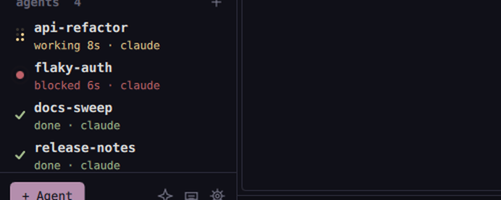

# Agents

Launching, profiles, exact status, the MCP server and the operator. Back to the [README](../README.md).

## Profiles

A named API key (Anthropic, OpenAI, OpenRouter, Gemini or any OpenAI-compatible endpoint, set up under Settings > Providers), injected as env vars (`ANTHROPIC_API_KEY`, ...) into the panes that use it. Keys live in the system keyring via Secret Service (`secret-tool`; falls back to a 0600 file), never in `settings.json`/`session.json`. Set a default profile, a per-space profile (right-click a space), or pick one per launch. `nebula ctl profile.list|set|remove|default|test`.

## Launcher

Open it with `Ctrl+Shift+L` or the `+` next to *agents*, then pick claude/codex/opencode/gemini/aider/shell (add your own in `~/.config/nebula/agents.conf`, one `name = command` per line), profile, model, directory, where to open it (split/tab/space), optionally a fresh **git worktree + branch** so parallel agents don't collide, and an initial prompt. `nebula ctl agent.launch agent=claude prompt="fix the flaky test" worktree=true branch=fix/flaky`. `Ctrl+Shift+M` broadcasts one prompt to several agents.

## Status

Every agent shows its state as a mark in the sidebar, on its pane title and in the status bar. Each mark is told apart by its shape and its motion, not only its color:

| Mark | State | Meaning |
|---|---|---|
| spinning dots (yellow) | working | busy, with how long it has been working: `working 2m 13s` |
| dot with a pulsing ring (red) | blocked | waiting for you, with how long it has waited |
| check (green) | done | finished while you were elsewhere |
| hollow ring | idle | waiting for a prompt |

Only working and blocked move, so anything that moves is either busy or needs you. If a working clock climbs far past what the task should take, look at that agent.

## Hooks

Exact `working / blocked / done` state instead of screen heuristics (Settings > Agent integrations). Claude Code (`~/.claude/settings.json`), opencode (plugin) and codex (`notify`, turn completion only). Your files are merged, never overwritten, and backed up as `*.nebula-bak`; Remove restores them. Hooks run `nebula ctl pane.report_state` and are silent no-ops outside nebula.

## MCP server

`nebula mcp` (stdio). Install it for claude/opencode/codex/gemini from Settings > Agent integrations, or add it yourself: `claude mcp add --scope user nebula -- /path/to/nebula mcp`. Tools: `whoami`, `list_panes`, `list_agents`, `list_spaces`, `list_profiles` (never secrets), `read_pane`, `send_text`, `send_keys`, `launch_agent`, `wait_for_state`, `broadcast`, `close_pane`, `create_space`, `view_show`, `view_components`, `view_get`, `view_export`, `view_snapshot` (see [views](views.md)). This lets one agent delegate to and supervise others. It is real terminal control: only install it in agents you trust.

## Operator

A built-in agent that operates *nebula itself* (`Ctrl+Shift+I`; configured under Settings > Agents & AI). It is a real agent CLI: nebula spawns it, gives it a `nebula` MCP server (the same tools external agents get, `src/tools.cpp`), and streams its turns into a panel. Because the agent authenticates itself, **subscriptions work out of the box** — Codex (ChatGPT) and Claude Code (subscription) are driven **natively**, with no adapter and no npm: Claude through `claude -p --input-format stream-json`, Codex through `codex app-server` (`src/nativeagents.cpp`). `opencode acp`, `gemini --acp` or any other [ACP](https://agentclientprotocol.com) command set under Settings > Agents & AI use ACP. Empty auto-detects codex → claude → opencode → gemini, and the chat has agent and model dropdowns (the model choice is remembered as `operatorModel`); when a configured model is unavailable, a stale model in the agent's own CLI config is healed automatically through `session/set_config_option` (or the native equivalent) using the account's real model list. Tell it things like "launch claude and codex on the flaky auth test, each in a worktree" or "which agents are blocked? approve the first one"; it lists/reads panes, launches and prompts agents, answers permission prompts, and reorganizes spaces/tabs/splits. Tool calls are **auto-approved by default** (the "auto-approve on" badge in the chat header toggles it); turn it off and every tool call shows an Allow/Deny prompt in the chat. The chat is restored after a restart as display history only (the agent starts fresh), idle agents that vanish are reconnected, and error cards have a *Copy log* button that copies the agent state, stderr and the last protocol lines for bug reports (`NEBULA_ACP_TRACE=1` also prints the wire log). Pane text is marked untrusted in the instructions sent to the agent. Non-interactive use: `nebula ctl operator.ask prompt="..." approve=all` (`approve=none` rejects every permission request).

## Summaries

Optional and off by default, because it sends terminal output to your provider: a one-line "what it did" when an unfocused agent finishes, shown in the sidebar and the desktop notification. Toggle under Settings > Agents & AI. `nebula ctl llm.ask prompt="..."` is a plain one-shot chat request against a profile.

## Agent state

Agent = foreground process (claude, opencode, codex, gemini, aider, ...). State is classified from the bottom of the screen with per-agent patterns (permission prompts -> `blocked`, "esc to interrupt" and title spinners -> `working`), plus output activity for unfocused panes, with debounce so spinners don't flicker. `done` = finished while you were elsewhere; cleared when you focus it. Notifications via `notify-send`.
