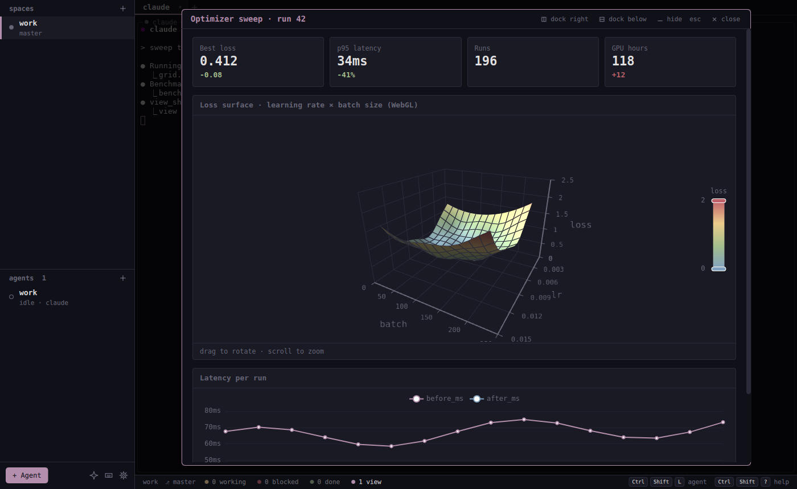
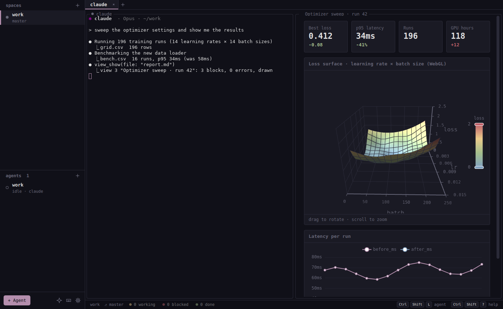
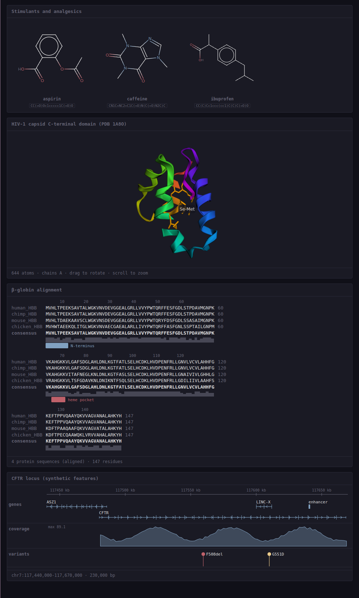
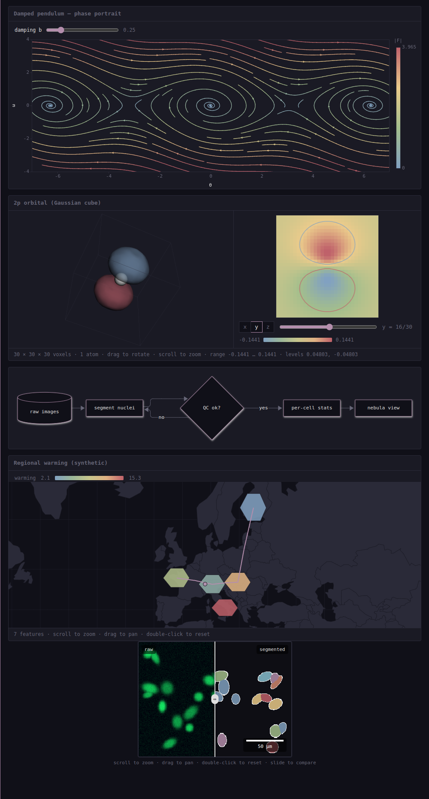
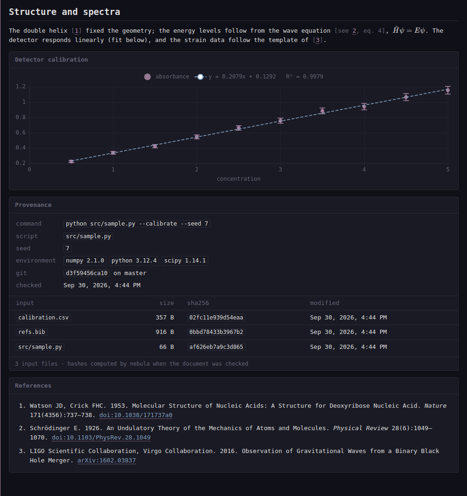
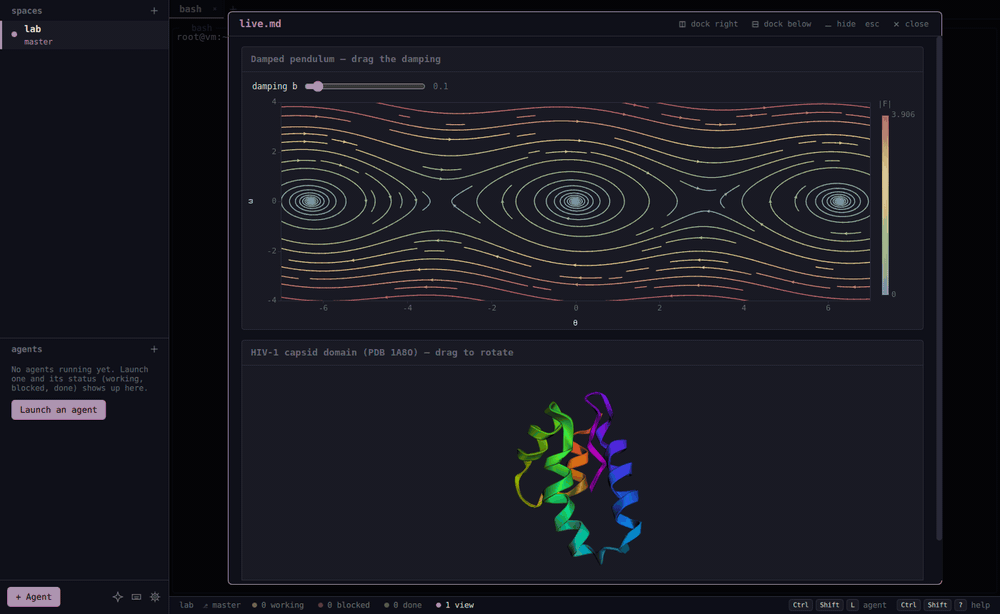
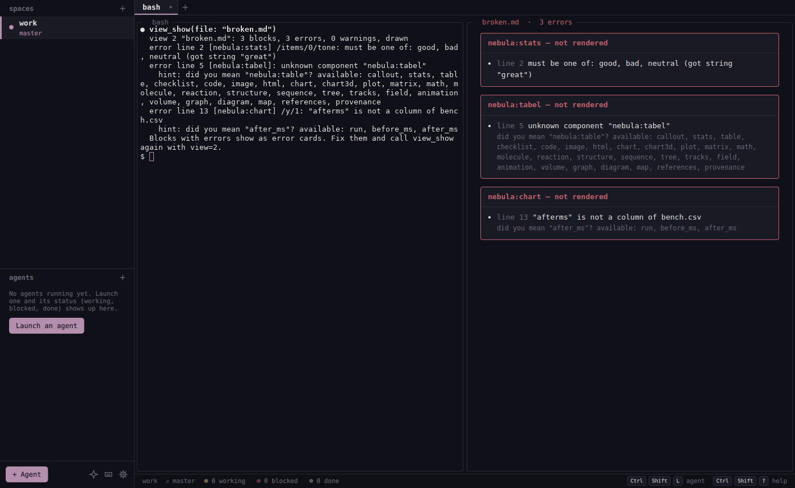

# Views

Agents show their results as documents instead of terminal output: Markdown plus components, checked before they are drawn. Back to the [README](../README.md).

| An agent's view, in the modal (default) | Docked next to the agent |
|---|---|
|  |  |


A view shows a document instead of a terminal. Agents create one with the `view_show` MCP tool (or anything else with `nebula ctl view.show`). By default it opens as a **modal** over the workspace, so small split panes are not squeezed; its header docks it next to the agent that made it (right or below), a docked view's pop-out button brings it back to the modal, and Settings > General > *Agent views open* makes docking (or a new tab) the default. `Esc`, `Ctrl+Shift+O` or a click outside hides the modal without losing it (the status bar shows `N views`; click it or press `Ctrl+Shift+O` again); *close* discards it. Docked views are saved with the session, modal ones are not.

The document is Markdown plus **components**, fenced blocks whose body is YAML:

````markdown
---
title: Session store refactor
---
The store now sits behind one interface.

```nebula:stats
- {label: Tests, value: 120, delta: +18, tone: good}
- {label: p95 latency, value: 38ms, delta: -41%, tone: good}
```

```nebula:table
data: results.csv          # read from disk: big data never goes through the model
sort: {by: failed, desc: true}
```
````

Components, by field (`view_components` lists them with a one-line summary each):

| Field | Component | Shows |
|---|---|---|
| General | `callout` | info / success / warning / danger / note box |
| | `stats` | a row of key numbers with change, tone, uncertainty (`12.3 ± 0.4`) and units |
| | `table` | sortable table from inline rows or a `.csv` / `.tsv` / `.json` file; columns with units and errors |
| | `checklist` | plan with a status per item (`[x]` done, `[~]` running, `[!]` failed, `[-]` skipped) and progress |
| | `code` | highlighted code, inline or from a file and line range |
| | `image` | a png / jpg / gif / webp / svg; optional zoom and pan, a before/after `compare` slider and a true scale bar (`scale: "0.65 µm"`) |
| | `html` | escape hatch: the agent's own HTML/CSS/JS (canvas, WebGL, SVG) in a sandbox, with the theme as CSS variables |
| Data and math | `chart` | line / bar / area / scatter / pie / histogram / box / heatmap; error bars, bands, fits (linear … power, with R²), log axes |
| | `chart3d` | 3D scatter / bar / line / surface in WebGL, rotatable, coloured by a column |
| | `plot` | formulas: `y = f(x)`, parametric, polar and surfaces; `params` can be sliders the reader drags |
| | `matrix` | a grid (CSV, `.npy`, inline) as heatmap, contour lines or WebGL surface |
| | `math` | a numbered display equation (KaTeX); `$…$` and `$$…$$` work in any Markdown |
| Chemistry and biology | `molecule` | 2D structures from SMILES, one or a grid |
| | `reaction` | reaction SMILES with conditions over the arrow |
| | `structure` | 3D molecules (PDB, mmCIF, SDF, MOL2, XYZ, GRO) in WebGL: cartoon or sticks, highlighted residues |
| | `sequence` | DNA / RNA / protein sequences and alignments (FASTA): residue colours, consensus, conservation, annotations |
| | `tree` | phylogenies from Newick: branch lengths, support values, highlighted leaves |
| | `tracks` | genome-browser tracks over a region: BED features with exons and strand, bedGraph signal, variants |
| Physics | `field` | vector fields from formulas or a `.npy` grid: evenly spaced streamlines, arrows, a scalar background, sliders |
| | `animation` | curves `y(x, t)`, moving points with trails, or simulation frames from `.npy`; play, pause, scrub |
| | `volume` | 3D scalar fields (`.npy`, Gaussian `.cube`): isosurfaces in WebGL next to a slice viewer |
| Networks, diagrams, maps | `graph` | networks from inline edges, a CSV edge list or JSON: force / circular layout, groups, weights, direction |
| | `diagram` | Mermaid (flowchart, sequence, class, state, ER, gantt, mindmap, …); a plain ```` ```mermaid ```` fence works too |
| | `map` | offline maps: GeoJSON and points over a built-in world basemap, choropleth by a property, projections |
| Research record | `references` | the numbered list of works cited with `[@key]` (BibTeX named in the front matter) |
| | `provenance` | what the results were computed from: every input file with its SHA-256, the git commit, command, environment, seed |

`view_components name=table` (or `nebula ctl view.components name=table`) returns a component's fields, shorthand and a valid example.

| Chemistry and biology | Physics, networks, maps, imaging | Research record |
|---|---|---|
|  |  |  |

<p align="center"></p>



**Checked before it is drawn.** Every document goes through one checker: YAML syntax, each component's schema, then semantic checks (a table column that is not in the CSV, a line range past the end of the file). `view_show` returns every problem with its line and a fix hint, e.g. `error line 12 [nebula:table] /colums: unknown field "colums" (did you mean "columns"?)`. Blocks with errors are drawn as error cards and the rest of the view still shows; the agent fixes the document and calls `view_show` again with `view=<id>` to update the same pane. Problems found while drawing (an image that does not decode) are reported too (`view_get`).

**Science in the checker, not only in the drawing.** Formats are parsed where the agent can be told what is wrong: a SMILES string with an unclosed ring, a PDB line with broken coordinates, a FASTA letter that is not an amino acid, a Newick tree missing a `)`, a GeoJSON written as latitude/longitude, a formula with an unknown variable (`sin(x - tt)`: did you mean `t`?), a slider whose value is outside its range, a citation key that is not in the bibliography. Heavy libraries (ECharts, KaTeX, 3Dmol.js, smiles-drawer, Mermaid, d3-geo) load only when a document uses them.

**Research record.** Put `bibliography: refs.bib` in the front matter and cite with `[@key]` or `[see @a, p. 3; @b]`: citations are numbered by first use and the list goes where `nebula:references` stands, or at the end. A `nebula:provenance` block lists every file the document read with its SHA-256, size and modification time, and the git commit of the repository it lives in (read from `.git`, no git process), next to the command, script, environment and seed the agent gives. **Export**: `view.export` writes a standalone HTML file (charts and WebGL frozen to images, files and fonts inlined, nothing pointing back into nebula) or a PDF. **Snapshot**: `view_snapshot` returns a PNG of the view to the agent as an MCP image, optionally scrolled to a block, so it can check that a plot or a molecule looks right before it tells you it is done.

**Files.** `view.show file=report.md` watches the file and every file the checker read for it (data, bibliographies, scripts), and re-checks and redraws on every save. Paths in a document are relative to its directory (for inline content: the agent's working directory) and cannot leave it: no absolute paths, no `..` escapes, no symlinks pointing outside.

**Isolation.** Views are drawn by Qt WebEngine in a private, off-the-record profile. A page gets only the checked document, can load only the files that document references, has no network access, cannot navigate, runs no `eval`, and raw HTML in Markdown is not rendered. Links open in your browser. An `html` block runs in its own sandboxed frame (opaque origin, no access to the view, nebula or storage, a CSP without any network source); its script errors are reported to the agent like any other render issue.

```sh
nebula ctl view.show file=report.md [where=modal|right|down|tab] [title=STR]
nebula ctl view.show content=@- < report.md          # inline content, stored with the session
nebula ctl view.show view=7 file=report.md            # update view 7 in place
nebula ctl view.dock view=7 where=right|down|tab|modal       # move between the modal and the layout
nebula ctl view.toggle                                        # hide / show the modal
nebula ctl view.get view=7 | view.list | view.close view=7 | view.components [name=table]
nebula ctl view.export view=7 format=html|pdf [path=report.pdf]   # standalone HTML, or PDF
nebula ctl view.snapshot view=7 [block=3] [path=shot.png]        # PNG of what the user sees
```

The checker and the page live in `renderer/` (JavaScript, bundled into `renderer/dist/`, which is committed so building nebula needs no node): the checker runs inside nebula in Qt's JS engine, the page in the web engine. `just renderer` rebuilds and tests it.
